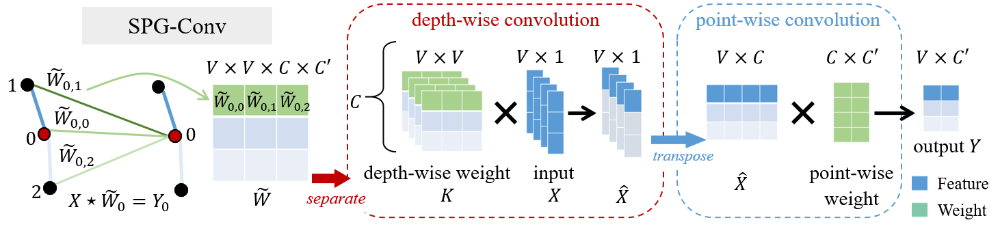
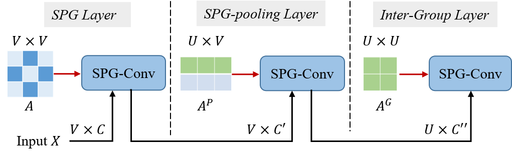

# MV-IGNet

The Official PyTorch implementation of **"Learning Multi-View Interactional Skeleton Graph for Action Recognition"** [[IEEEXplore](https://ieeexplore.ieee.org/abstract/document/9234715)] in TPAMI 2020. The arXiv version of our paper is coming soon. 

## Contents
<!-- - [MV-IGNet](#mv-ignet) -->
1. [Current Status](#current-status)
2. [Overview and Advantages](#overview-and-advantages)
3. [Requirements](#requirements)
4. [Installation](#installation)
5. [Data Preparation](#data-preparation)
6. [Training](#training)
7. [Evaluation](#evaluation)
8. [Results](#results)
9. [Citation](#citation)
10. [Acknowledgement](#acknowledgement)

## Current Status
  - [x] NTU-RGB+D
    - [x] Data Preparation
    - [x] Models
      - [x] SPGNet
      - [x] HPGNet
      - [x] MV-HPGNet
  - [ ] NTU-RGB+D 120

## Overview and Advantages

+ Lighter Network with Higher Accuracy
  - Smaller Model
    - You only need `2.5 M` to save our model
  - Faster Inference (on `single NVidia 2080 Ti`)
    - `8 s` inference time on Cross-View validation set of NTU-RGB+D
    - `1min 20s` training time per epoch on Cross-View training set of NTU-RGB+D
  - Higher Accuracy
    - Please refer to the [Results](#results)
+ Efficient Unit: SPGConv for Richer Context Modeling
  - The key code of SPGConv
    ```python
    # set graph
    dw_gcn_weight = self.dw_gcn_weight.mul(self.A)
    # depth-wise conv
    x = torch.einsum('nctv,cvw->nctw', (x, dw_gcn_weight))
    # point-wise conv
    x = torch.einsum('nctw,cd->ndtw', (x, self.pw_gcn_weight))
    ```
  - Illustration
    <div align=center>
    
    </div>

+ Unified Framework: Easy to Implement
  <div align=center>
  
  </div>

---

## Requirements
We only test our code on the following environment:
  - Python == 3.7
  - [PyTorch](https://pytorch.org/) == 1.2.0 (Our code runs slow when PyTorch >=1.4.0)
  - CUDA == 10.0 or 10.1

## Installation
  ```bash
  # Install python environment
  $ conda create -n mvignet python=3.7
  $ conda activate mvignet

  # Install Pytorch 1.2.0 with CUDA 10.0 or 10.1
  $ pip install torch==1.2.0 torchvision==0.4.0

  # Download our code
  $ git clone https://github.com/niais/mv-ignet
  $ cd mv-ignet

  # Install torchlight
  $ cd torchlight; python setup.py install; cd ..

  # Install other python libraries
  $ pip install -r requirements.txt
  ```

## Data Preparation

- [NTU RGB+D](http://rose1.ntu.edu.sg/datasets/actionrecognition.asp): only the **3D skeleton** (5.8GB) modality is required in our experiments. You can put the raw data in the directory `<path to nturgbd+d_skeletons>` and build the database as:

  ```bash
  # generate raw database
  $ python tools/ntu_gendata.py --data_path <path to nturgbd+d_skeletons>

  # process the above raw data for our method
  $ python feeder/preprocess_ntu.py
  ```

## Training

- Example for training **MV-HPGNet** on `ntu-xview`. You can train other models by using `.yaml` files at `config/` folder.
  ```bash
  # train hpgnet with physical graph
  $ python main.py rec_stream --config config/mv-ignet/ntu-xview/train_hpgnet_simple.yaml --device 0 1
  # train hpgnet with complement graph
  $ python main.py rec_stream --config config/mv-ignet/ntu-xview/train_hpgnet-complement_simple.yaml --device 2 3
  ```

- About multi-view training: you need train two models as above, with a skeleton graph and its complement graph respectively. We save the complement graph in `complement_graph_1.npz` for convenient and you can compute it yourself:
  - how to use `complement_graph_1.npz`:
    ```python
    import numpy as np
    saved_graph = np.load('complement_graph_1.npz')
    # 'cA' is the adjacent matrix and 'norm_cA' is its normalization
    cA, norm_cA = saved_graph['a'], saved_graph['na']
    ```
  - how to compute it yourself:
    ```python
    # given the adjacent matrix A, its complement cA can be computed by:
    cA = 1.0 - A
    ```


- Trained Models: we have put our checkpoints on NTU-RGB+D dataset at `weights/` folder:
  ```bash
  # checkpoints on NTU-RGB+D dataset
  weights
    ├── xsub
    │    ├── xsub_HPGNet_epoch120_model.pt
    │    └── xsub_HPGNet-complement_epoch120_model.pt
    └── xview
         ├── xsub_HPGNet_epoch120_model.pt
         └── xsub_HPGNet-complement_epoch120_model.pt
  ```

## Evaluation

- Example for `single model` evaluation (HPGNet model):
  ```bash
  # evaluate hpgnet model with physical graph
  $ python main.py rec_stream --phase test --config config/mv-ignet/ntu-xview/train_hpgnet_simple.yaml --weights <path to weights>
  # evaluate hpgnet model with complement graph
  $ python main.py rec_stream --phase test --config config/mv-ignet/ntu-xview/train_hpgnet-complement_simple.yaml --weights <path to weights>
  ```
- Example for `multi model` evaluation (MV-HPGNet model):
  ```bash
  # we provide 'eval_ensemble.sh' file to do this simply
  $ python main.py rec_ensemble \
           --config config/mv-ignet/ntu-xview/test_hpgnet_ensemble_simple.yaml \
           --weights <path to model-1 weights> \
           --weights2 <path to model-2 weights>
  ```
  Note that before evaluating `multi-view model`, you must have trained two models with the skeleton graph and its complement graph respectively in [Training](#training).

## Results

The expected **Top-1** **accuracy** results on **NTU-RGB+D 60** dataset are shown here:

| Model     | Cross View (%) | Cross Subject (%) |
| :-------- | :------------: | :---------------: |
| ST-GCN    |      88.8      |       81.6        |
| SPGNet    |      94.3      |       86.8        |
| HPGNet    |    **94.7**    |     **87.2**      |
| MV-HPGNet |    **95.8**    |     **88.6**      |

---

## Citation
Please cite our paper if you find this repo useful in your resesarch:

```txt
@article{wang2020learning,
  title={Learning Multi-View Interactional Skeleton Graph for Action Recognition},
  author={Wang, Minsi and Ni, Bingbing and Yang, Xiaokang},
  journal={IEEE Transactions on Pattern Analysis and Machine Intelligence},
  year={2020},
  publisher={IEEE}
}
```

## Acknowledgement
The framework of current code is based on the old version of [ST-GCN](https://github.com/yysijie/st-gcn/blob/master/OLD_README.md) (Its new version is [MMSkeleton](https://github.com/open-mmlab/mmskeleton)).
- [ST-GCN](https://github.com/yysijie/st-gcn/blob/master/OLD_README.md)
- [Awesome-Skeleton-based-Action-Recognition](https://github.com/niais/Awesome-Skeleton-based-Action-Recognition)
